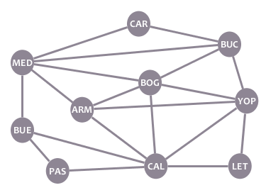
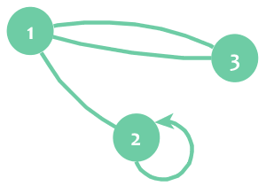

# ¡Te doy la bienvenida!

This short playground will give you some fundamentals about graph theory: What graphs, nodes and edges are, and how can they be used to model information and solve problems.

Want to help with more content or fixing a mistake? [Find this Playground in Github!](https://github.com/Racso/playground-NpnXDluI)

# Prerequisites
* None.

# Graphs, nodes and edges

Look at the following image:

The image represents some Colombian cities: Cartagena, Bucaramanga, Medellín, Bogotá, and other. Each circle is a city. The lines connecting the circles represent commercial flights that you can take between cities. For example, you can fly from Bucaramanga (BUC) to Bogotá (BOG), as those cities are connected with a line, but you can't fly from Pasto (PAS) to Leticia (LET) because they aren't connected.

Easy, right? Well, that's a graph, and they are indeed easy to understand. **Graphs** are structures that allow us to model relationships between elements. In this case, we used a graph to model flight connections between cities.

Graphs are composed of two kind of elements:
1. **Vertices or nodes**, which represent elements. In the image, the circles are the nodes, each node representing a city.
2. **Edges**, which represent relations between elements. In the image, the lines are the edges, each edge representing a flight connection between cities.

Each edge connects exactly two nodes. This means that you'll never find and edge with one side pointing to nowhere.

We say that two nodes are neighbors if there is an edge connecting them. In the example, Bucaramanga (BUC) and Bogotá (BOG) are neighbors, but Pasto (PAS) and Leticia (LET) are not neighbors.

?[How many neighbors does node BUC have?]
-[ ] 3
-[ ] 6
-[x] 4
-[ ] 5

A graph can be drawn in different ways without changing it at all. How and where you draw the nodes and edges of a graph doesn't matter; what matters is what nodes does the graph contain and how are they connected. For example, our cities graph can be redrawn in the following way, without changing it:

Based on a graph, you can easily calculate things about the situation you're modelling. For small graphs, you can make it by hand. For bigger graphs, you can code simple programs or use well-known algorithms to tackle the problem. Try solving the following questions about our cities graph:

?[How many cities are there?]
-[x] 10
-[ ] 9
-[ ] 8
-[ ] 11

?[If I want to fly from Cartagena (CAR) to Pasto (PAS), What's the MINIMUM amount of flights that I need to take?]
-[x] 3
-[ ] 2
-[ ] 4
-[ ] 5

# Loops and parallel edges

Our cities graph is a **simple graph**, as it doesn't have **"loops"** or **"parallel edges"**. Let's see what those are. The following graph is **non-simple**:

In this graph, there's an edge connecting node 2 with itself. That edge is a loop. In other words, a **loop** is an edge that starts and finishes in the same node. That node is connected to itself, and therefore is its own neighbor.

You can also see that nodes 1 and 3 are connected by two edges. Those edges are "parallel edges", or "multiple edges". In other words, several edges are **parallel edges** if they connect the same pair of nodes.

Loops and parallel edges are useful for certain, specific applications. However, for lots of real life applications (probably most of them), you don't want to have loops or parallel edges in your graphs. Graphs without loops or parallel edges are called **simple graphs**.

# The degree of a node
The **degree** of a node is the amount of edges incident on it. "Edges incident on a node" are edges that connect that node with another one (or itself, in the case of a loop), or edges that "touch" that node.

In a simple graph, the degree of a node is equal to the amount of neighbors it has. On the other hand, when a node has a loop, the loop adds 2 to the degree of the node.

In our non-simple graph example above, the degrees of the nodes are the following:
* deg(**1**) = 3
* deg(**2**) = 3 (remember: the loop adds 2)
* deg(**3**) = 2

# Directed graphs

Let's suppose we want to model some Twitter users with a graph. This is the information about the users:

- Alice (A) follows Bob and Carol.
- Bob (B) follows Alice.
- Carol (C) follows Bob.

OK, cool. We can model people as nodes and "follows" as edges. However, this time we have an extra ingredient: direction.

In Twitter, following a person goes in one direction: you may follow one person, but that person may or may not follow you back. In our example, Carol follows Bob, but Bob doesn't follow Carol back. Something similar happens with personal relationships in real life: you may like a person, but that person may or may not like you back.

Is because of this asymmetry that our graph needs a way to convey who follows whom. This is done with **directed edges**:

Directed edges look like arrows. They have a starting node and an ending node.

Our directed graph easily shows us some information about our users. For example, it's clear that Alice and Bob follow each other, and that Bob is the person with the most followers (because two arrows point to B).