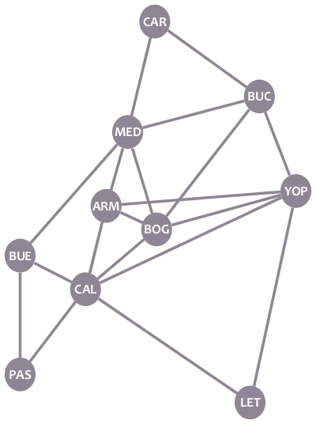
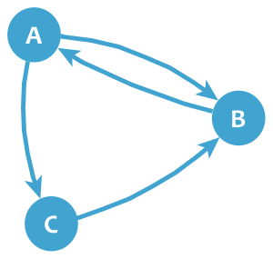

We already know what graphs are. Now, let's see how can we represent graphs in ways other than drawing. This will be useful if we want to work with graphs with a computer.

# Adjacency List

Remember our cities graph?

Let's make a list of each node's neighbors:

* **CAR:** MED, BUC
* **MED:** CAR, BUC, BUE, ARM, BOG
* **BUC:** CAR, MED, BOG, YOP
* **BUE:** MED, CAL, PAS
* **ARM:** MED, BOG, CAL
* **BOG:** MED, BUC, YOP, ARM, CAL
* **YOP:** BUC, ARM, BOG, LET
* **CAL:** BUE, ARM, BOG, YOP, LET, PAS
* **PAS:** BUE, CAL
* **LET:** CAL, YOP

That's the **adjacency list** of the graph: a list of lists describing the neighbors of each node.

If the graph is directed, a node B only appears in the list of a node A if there's an edge from A to B. For example, in our directed Twitter graph:

* **A:** B, C
* **B:** A
* **C:** B

# Adjacency Matrix

Graphs can also be represented with **adjacency matrices**. Here's the adjacency matrix of our cities graph:

|	|CAR	|BUC	|YOP	|BOG	|LET	|CAL	|ARM	|MED	|BUE	|PAS    |
|---	|---	|---	|---	|---	|---	|---	|---	|---	|---	|---    |
|**CAR**|0	|1	|0	|0	|0	|0	|0	|1	|0	|0      |
|**BUC**|1	|0	|1	|1	|0	|0	|0	|1	|0	|0      |
|**YOP**|0	|1	|0	|1	|1	|1	|1	|0	|0	|0      |
|**BOG**|0	|1	|1	|0	|0	|1	|1	|1	|0	|0      |
|**LET**|0	|0	|1	|0	|0	|1	|0	|0	|0	|0      |
|**CAL**|0	|0	|1	|1	|1	|0	|1	|0	|1	|1      |
|**ARM**|0	|0	|1	|1	|0	|1	|0	|1	|0	|0      |
|**MED**|1	|1	|0	|1	|0	|0	|1	|0	|1	|0      |
|**BUE**|0	|0	|0	|0	|0	|1	|0	|1	|0	|1      |
|**PAS**|0	|0	|0	|0	|0	|1	|0	|0	|1	|0      |

Adjacency matrices have the graph nodes in both their rows and columns. The value on each cell shows if there exists an edge between the pair of nodes of the corresponding row and column. For example, the cell in row **BOG** and column **BUC** has a value of **1** because there is an edge between BOG and BUC, whereas the cell in row **PAS** and column **YOP** has a **0** because there's no edge between those two nodes.

A graph may have several adjacency matrices. In the example above, if you put the nodes in a different order, you'll have a new adjacency matrix of the same graph.

As you may check, if a graph is undirected, its adjacency matrices are symmetrical. On the other side, if the graph is directed, the matrices are not symmetrical, as a 1 only appears in a cell if there's an edge from the node of the row to the node of the column. For example, the following is the adjacency matrix of our Twitter graph:

|   | A | B | C |
|---|---|---|---|
|**A**|0|1|1|
|**B**|1|0|0|
|**C**|0|1|0|

# Exercise
The shown Python function is used during step 2 in the algorithm. It selects the node that should be set as current node. Fix it so it picks the correct node.

@[The shown function should select a new current node for Dijkstra's Algorithm. Fix it so it does it correctly.]({"stubs": ["nodes.py"], "command": "python3 test_nodes.py"})
